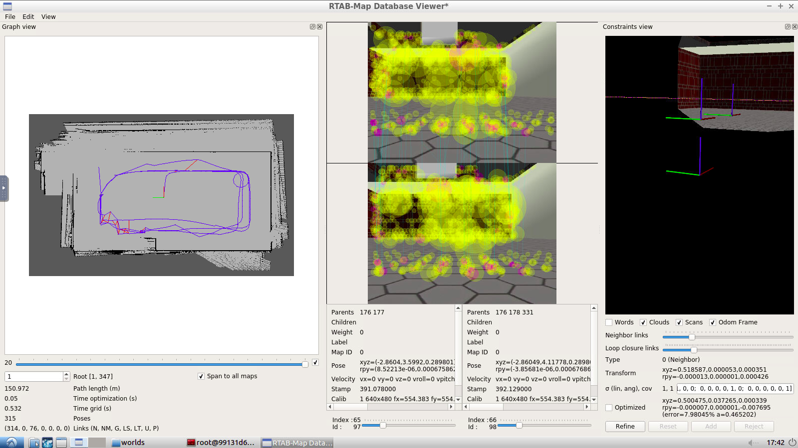

# RoboND-Map My World



## How to run

* Clone this repo

  ```
  https://github.com/shengchen-liu/RobotND_Map_My_World.git
  ```

* Open the repository and make

  ```shell
  cd ~/workspace/catkin_ws
  catkin_make
  ```

* Launch my_robot in Gazebo to load both the world and plugins

  ```shell
  source devel/setup.bash
  roslaunch mapmyworld_my_robot world.launch
  ```

* Launch teleop_twist_keyboard node, open a new terminal, enter

  ```shell
  source devel/setup.bash
  rosrun teleop_twist_keyboard teleop_twist_keyboard.py
  ```

* Launch mapping node, open a new terminal, enter

  ```shell
  source devel/setup.bash
  roslaunch mapmyworld_my_robot mapping.launch
  ```

* View database Once you statisfied with your move, press `Ctrl + c` to exit then view your database with

  ```
  rtabmap-databaseViewer ~/.ros/rtabmap.db
  ```

## Database link

https://drive.google.com/file/d/1rZMdrY6MMyK8ZZKEaLgBEBt6v23dTSeP/view?usp=sharing

## Tips

Do a rostopic list to see which of the topics actually have that name. Are you sure the camera topics have those names? Do the rostopic list and you will be sure (without first launching amcl)

Also do an rqt_graph to see how everything is connected

Also use rqt_topic to see what is published and what is subscribed# RobotND_Map_My_World

